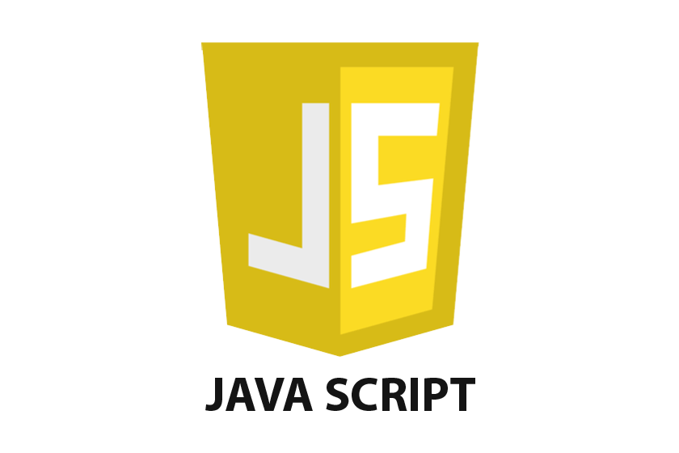

### Hi there 👋

<!--
**SoniBhanu/SoniBhanu** is a ✨ _special_ ✨ repository because its `README.md` (this file) appears on your GitHub profile.

Here are some ideas to get you started:

- 🔭 I’m currently working on ...
- 🌱 I’m currently learning ...
- 👯 I’m looking to collaborate on ...
- 🤔 I’m looking for help with ...
- 💬 Ask me about ...
- 📫 How to reach me: ...
- 😄 Pronouns: ...
- ⚡ Fun fact: ...
-->

(github-header-image.png)

# About Me

Software Engineer with background in Web Development with relevant experience of internship as a front-end web developer in a startup and several projects in NodeJS, ReactJs and Django. Regaular participation in competitive coding contests on; and I have good knowledge of Data Structures and Algorithms. Participated in several hackathons and coding competitions.

# My Stats

 

 

# Languages that I know

 

# Enviornments I work with

